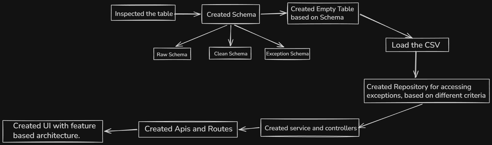

# Mini Exception Inbox

A full-stack manufacturing exception management system built as part of the internship assignment.

The system ingests production CSV files, validates and normalizes the data, detects production deficit exceptions, stores them as materialized database records, exposes REST APIs for querying and updating exceptions, and provides a React-based inbox UI for planners to review and manage production issues.

---

# System Overview

The project follows a layered architecture and an ETL (Extract → Transform → Load) pipeline.

Instead of calculating production deficits on every frontend request, the application materializes exception records into a dedicated database table. This keeps the API simple, improves query performance, and mirrors how real manufacturing and ERP systems process operational data.

---

# Architecture Diagram



---

# Overall Workflow

```text
Production Plan CSV
                        \
                         \
                          --> Raw Tables
                         /
Actual Production CSV
        │
        ▼
Validation
        │
        ▼
Normalization
        │
        ▼
Clean Tables
        │
        ▼
Exception Generation
        │
        ▼
Exception Table
        │
        ▼
Express REST API
        │
        ▼
React Inbox Dashboard
```

---

# Tech Stack

| Layer | Technology | Why |
|--------|------------|-----|
| Frontend | React + TypeScript | Component-based architecture |
| Styling | TailwindCSS | Utility-first styling |
| State Management | Redux Toolkit | Predictable global state |
| Charts | Recharts | 7-day trend visualization |
| Backend | Express.js | Lightweight REST API |
| Language | TypeScript | Type safety |
| ORM | Prisma | Type-safe database access |
| Database | SQLite | Zero configuration, lightweight, assignment requirement |
| CSV Parsing | csv-parser | Efficient streaming CSV parser |

---

# Backend Architecture

The backend follows a layered architecture.

```text
Request

↓

Routes

↓

Controllers

↓

Services

↓

Repositories

↓

Prisma ORM

↓

SQLite Database
```

## Repository Layer

Responsible only for communicating with the database.

Examples:

- Query exceptions
- Update status
- Dashboard summary
- Retrieve exception trends

---

## Service Layer

Contains business logic.

Examples:

- Validate requests
- Check business rules
- Generate responses
- Coordinate repository operations

---

## Controller Layer

Responsible only for HTTP communication.

Examples:

- Receive requests
- Parse query parameters
- Call services
- Return JSON responses

---

## Routes

Maps API endpoints to controller methods.

---

# Database Design

The project intentionally separates raw imported data from cleaned business data.

## Raw Tables

### raw_production_plan

Stores production plan exactly as imported from the CSV.

Purpose:

- Preserve original data
- Audit imports
- Support reprocessing

---

### raw_actual_production

Stores actual production exactly as received.

Purpose:

- Preserve imported data
- Enable ETL replay

---

## Clean Tables

### production_plan

Normalized production planning data used by the application.

---

### actual_production

Normalized production data after validation and transformation.

---

## Exception Table

Stores materialized production deficit exceptions.

Fields include:

- planned_units
- actual_units
- deficit_units
- deficit_percentage
- severity
- status

The frontend queries this table directly instead of calculating exceptions dynamically.

---

# ETL Pipeline

The backend follows a three-stage ETL pipeline.

## 1. Extract

- Read CSV files
- Parse records
- Validate data
- Skip invalid rows
- Store valid rows into raw tables

---

## 2. Transform

Convert raw data into normalized business entities.

Creates:

- production_plan
- actual_production

---

## 3. Load

Compare production plans against actual production.

Generate materialized exception records.

Severity Rules

```
HIGH

actual < 70% of planned

MEDIUM

70% ≤ actual < 90% of planned
```

Each exception is stored permanently in the database.

---

# API Endpoints

## Exceptions

### Get All Exceptions

```
GET /api/exceptions
```

Supports

- Pagination
- Product filter
- Severity filter
- Status filter

Sorted by

- Date descending
- Highest deficit first

---

### Get Exception Details

```
GET /api/exceptions/:id
```

Returns

- Exception details
- Planned units
- Actual units
- Deficit percentage
- Last 7-day production trend

---

### Update Status

```
PATCH /api/exceptions/:id
```

Updates

```
OPEN

↓

ACKNOWLEDGED

↓

RESOLVED
```

---

### Dashboard

```
GET /api/dashboard
```

Returns

- Total Exceptions
- High
- Medium
- Open
- Acknowledged
- Resolved

---

# Frontend

The frontend follows a feature-based architecture.

Features include:

- Dashboard Timeline
- Daily collapsible groups
- Severity badges
- Product filters
- Severity filters
- Exception detail drawer
- Interactive 7-day production trend
- Status updates without page reload

---

# Project Structure

```text
.
├── backend
│   ├── prisma
│   ├── data
│   │   ├── actual_production.csv
│   │   ├── production_plan.csv
│   ├── src
│   │   ├── config/
│   │   ├── controllers/
│   │   ├── middlewares/
│   │   ├── repositories/
│   │   ├── routes/
│   │   ├── scripts/
│   │   │   ├── import/
│   │   │   └── transform/
│   │   ├── services/
│   │   ├── types/
│   │   ├── utils/
│   │   ├── validators/
│   │   └── app.ts
│   └── server.ts
│   └── .env
│   └── .dockerignore
│   └── dockerfile
│   └── package.json
│
├── frontend
│   ├── src/
│   │   ├── app/
│   │   ├── assets/
│   │   ├── features/
│   │   │   ├── dashboard/
│   │   │   └── exceptions/
│   │   │       ├── api/
│   │   │       ├── components/
│   │   │       ├── slices/
│   │   │       └── utils/
│   │   ├── pages/
│   │   ├── shared/
│   │   │   ├── api/
│   │   │   ├── components/
│   │   │   ├── lib/
│   │   │   └── types/
│   │   ├── main.tsx
│   │   └── index.css
│   ├── .dockerignore
│   ├── dockerfile
│   ├── vite.config.ts
│   └── package.json
│
├── assets
│   └── architecture.png
│
├── docker-compose.yml
├── AI_USAGE.md
├── APPROACH.md
└── README.md
```

---

# Data Quality Issues Found

While inspecting the production planning data, two records contained missing values for **planned_units**.

Instead of inserting incomplete records into the database, the ETL pipeline:

- Validated every row
- Logged invalid row numbers
- Skipped corrupted records
- Continued importing valid records

Import Summary

| Metric | Value |
|---------|------:|
| Total Production Plan Rows | 1085 |
| Imported | 1083 |
| Skipped | 2 |

This approach preserves data quality while ensuring the import process remains fault tolerant.

---

# Running the Project

Evrything is configured, in the docker, just run 

```bash
docker compose up --build
```

---

# Future Improvements

Given additional development time, the following improvements would be implemented:

- Background ETL jobs
- Authentication and authorization
- Dockerized deployment
- Unit and integration testing
- Server-side caching
- Advanced analytics dashboard
- Audit logs
- Real-time updates using WebSockets

---

# Author

**Vishal Raj**

Intern Hiring Assignment — Mini Exception Inbox